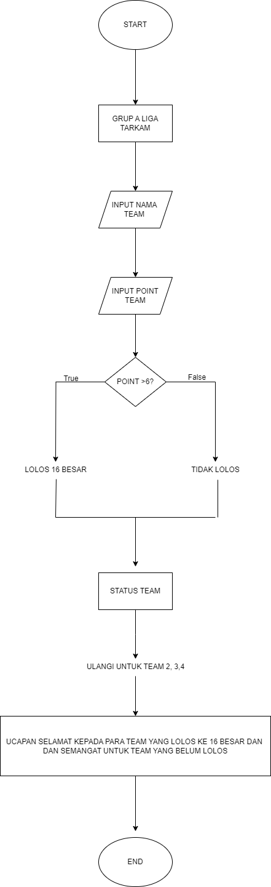

# GRUP A LIGA TARKAM

## Studi Kasus
karena banyaknya masyarakat kabupaten tegal khususnya daerah adiwerna yang gemar bermain dan menonton bola, maka saya membuat program ini demi membangun persepakbolaan kabupaten tegal.

## Proses Codingan
1. Inisiasi Data
Inisialisasi: Program dimulai dengan menampilkan judul "GRUP A LIGA TARKAM".
2. Input Data Tim:
Program meminta pengguna untuk memasukkan nama tim dan jumlah poin yang diperoleh.
Poin yang dimasukkan akan dievaluasi untuk menentukan status kelulusan tim (apakah tim lolos ke 16 besar atau tidak).
3. Evaluasi Status:
Program menggunakan kondisi if untuk mengevaluasi apakah poin tim lebih dari 6.
Jika poin lebih dari 6, status tim akan dicetak sebagai "lolos 16 besar".
Jika tidak, status tim akan dicetak sebagai "tidak lolos".
4. Pengulangan: Langkah 2 dan 3 diulang untuk 4 tim.
5. Pesan Penutup: Setelah semua tim dievaluasi, program menampilkan pesan selamat untuk tim yang berhasil lolos dan memberikan semangat untuk tim lainnya yang belum lolos.

## Langkah Langkah Program
Berikut adalah langkah-langkah lebih terperinci berdasarkan program yang diberikan:
1. Cetak Judul
   > print("GRUP A LIGA TARKAM")
2. Input dan Evaluasi untuk Tim 1:
Minta input nama tim, Minta input poin, Tentukan status:
   >nama_team = str(input("Nama Team : "))
    point = int(input("Point : "))
    status = "lolos 16 besar" if point >6 else "tidak lolos"
    print(status)
3. Input dan Evaluasi untuk Tim 2:
Proses yang sama diulang untuk tim kedua:
   >nama_team = str(input("Nama Team : "))
    point1 = int(input("Point : "))
    status = "lolos 16 besar" if point1 >6 else "tidak lolos"
    print(status)
4. Input dan Evaluasi untuk Tim 3:
Proses yang sama diulang untuk tim ketiga:
   >nama_team = str(input("Nama Team : "))
    point2 = int(input("Point : "))
    status = "lolos 16 besar" if point2 >6 else "tidak lolos"
    print(status)
5. Input dan Evaluasi untuk Tim 4:
Proses yang sama diulang untuk tim ke empat:
   >nama_team = str(input("Nama Team : "))
    point3 = int(input("Point : "))
    status = "lolos 16 besar" if point3 >6 else "tidak lolos"
   print(status)
6. Pesan Penutup:
Setelah semua tim dinilai, tampilkan pesan selamat dan semangat:
   >print("SELAMAT UNTUK LUWUNG FC DAN PERSEBAT LOLOS KE 16 BESAR")
    print("TETAP SEMANGAT UNTUK TEAM YANG BELUM LOLOS DAN COBA LAGI DI TURNAMEN BERIKUTNA")
    print("MATURNUWUNUWUN")
   
